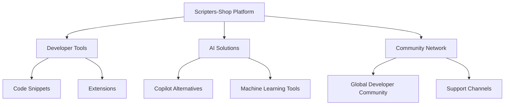

# 🌐 Scripters-Shop: Intelligent Developer Ecosystem

## 🚀 Platform Overview

Scripters-Shop is a cutting-edge platform designed to revolutionize developer productivity through innovative tools, AI integrations, and comprehensive development solutions.

## 🌟 Key Features

### Developer Toolkit
- **Code Snippets**: Ready-to-use, optimized code fragments
- **Extension Libraries**: Powerful, modular development tools
- **Workflow Accelerators**: Intelligent productivity enhancers

### AI-Powered Solutions
- **Coding Assistants**: Advanced AI-driven development support
- **Predictive Frameworks**: Machine learning-enhanced coding tools
- **Automated Workflow Generators**: Smart development optimization

## 🔬 Platform Architecture

## 🌍 Global Connectivity

- **Website**: [scripters.shop](https://scripters.shop)
- **Telegram**: [@ScriptersShop](https://t.me/ScriptersShop)
- **GitHub**: [Development Repositories](https://github.com/Scripters-Shop)
- **Contact**: dev@scripters.shop

## 🛠 Technology Stack

- **Frontend**: React, Tailwind CSS
- **Backend**: Serverless Architecture
- **AI Integration**: Advanced Machine Learning Models
- **Support**: 24/7 Developer Assistance

## 📊 Value Proposition

1. **Increased Productivity**: Reduce development time by 40%
2. **Intelligent Assistance**: AI-powered coding support
3. **Comprehensive Ecosystem**: All-in-one developer platform

## 🔑 Keywords

`developer tools` | `AI coding` | `workflow optimization` | `intelligent development` | `tech ecosystem`

## 💡 Mission Statement

Empowering developers worldwide by providing innovative, intelligent, and intuitive development solutions that transform the way code is created and managed.

---

**Engineered for Next-Generation Developers** 🧠💻

*Built with passion, powered by innovation.*
